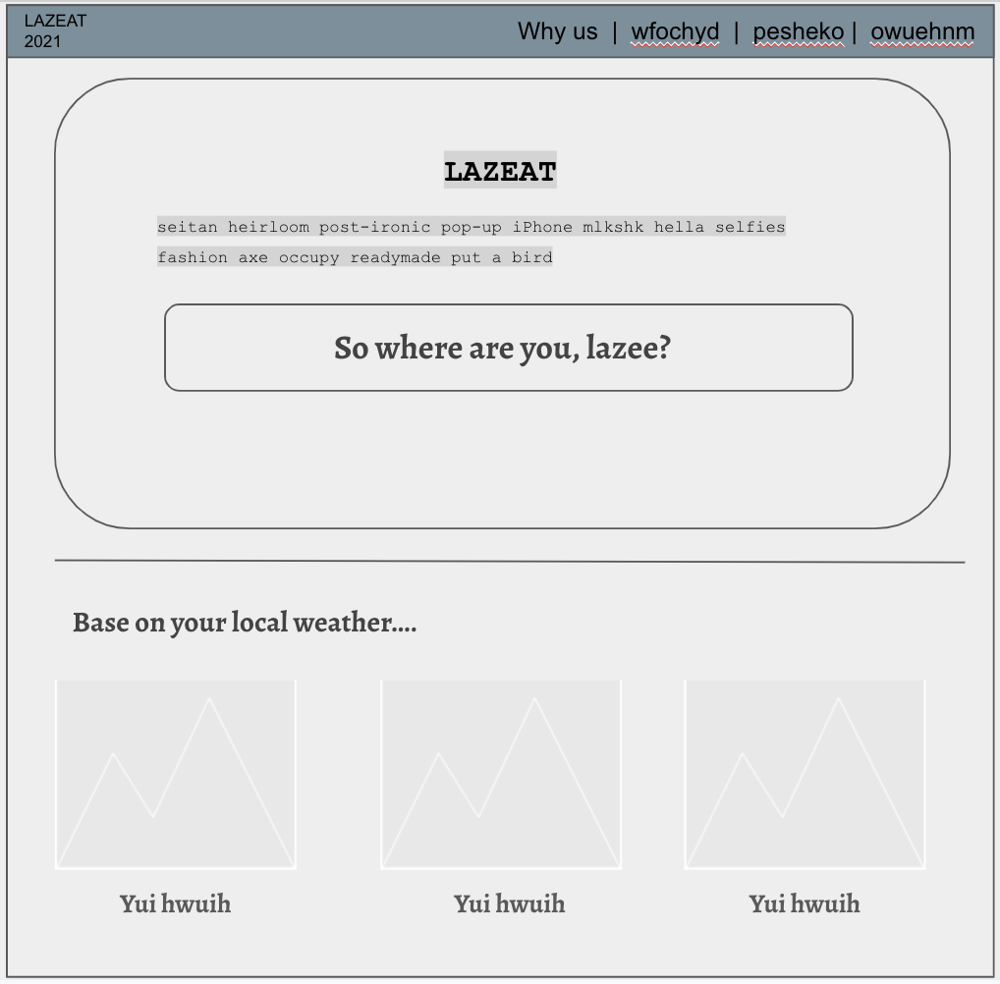

# LazEat

## Description

Generate meal suggestions based on selected protein and current weather.

## User Story

AS A lazy, remote worker with little time to decide what to eat,
I WANT to view suggestions based on a chosen protein and preparation based on the current weather
SO THAT I can make a decision on what to eat without thinking to much.

## Wireframe

## APIs Used

- USDA Food Nutrition Facts

- OpenWeatherMap

## Breakdown of Tasks

**Justin** - APIs

- Discover API documentation

- Develop functions for returning required data from API resources

**Jovial** - Design and Aesthetics

- Wireframe

- CSS Framework

- HTML and CSS code

**Jake** - Main Logic and JavaScript

- User interactivity

- Behind-the-scenes logic and data handling

- Data persistence
